# 🍵 Mellow — Your Soft Place to Land

A warm, single-page café website with a full ordering experience — browse a global comfort-food menu, customize items, check out, and track your order in real time. Built with plain HTML, CSS, and JavaScript — no frameworks, no build step.

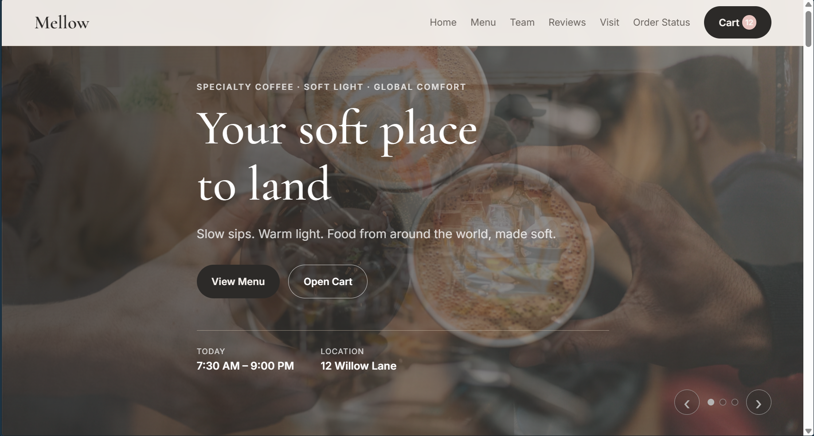

## ✨ Features

- **Hero image slider** — auto-rotating banner with manual arrow/dot controls
- **Filterable menu** — Signature Drinks, Chinese, Italian, Mexican, and Indian dishes, filterable by category
- **Item customization modal** — choose size, add sauce or extra cheese, set quantity, and see the live price update
- **Shopping cart** — add, update, and clear items, with subtotal/total calculated automatically and persisted in `localStorage`
- **Checkout flow** — collect customer details, pickup time, and special/chef notes, then place the order
- **Order confirmation** — generates a unique order number and estimated pickup time
- **Order status tracker** — look up any order by number to see its live prep timeline and assigned staff member
- **Team & owner section** — meet the people behind the café
- **Customer reviews** — star-rated reviews with a submission form (persisted in `localStorage`)
- **Fully responsive** — mobile nav menu, adaptive grid layouts, and touch-friendly controls

## 📸 Screenshots

| Menu | Customize Item |
|---|---|
| 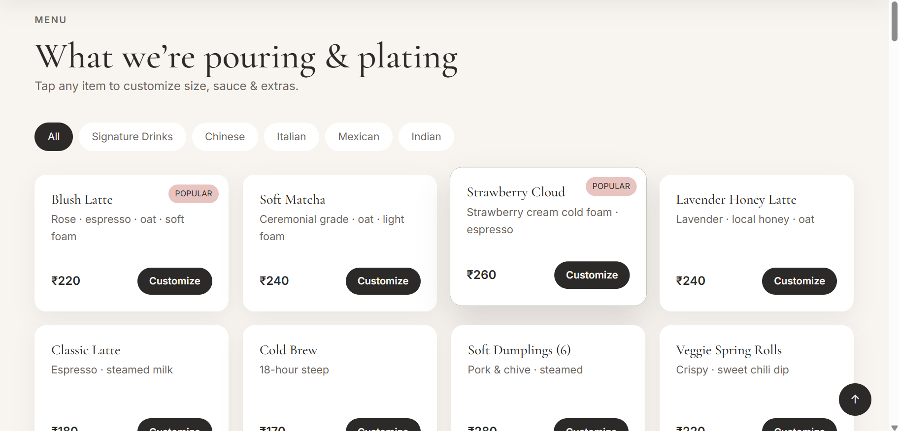 | 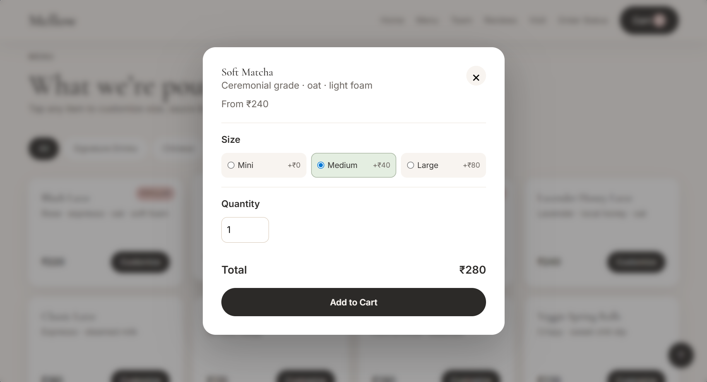 |

| Team | Reviews |
|---|---|
| 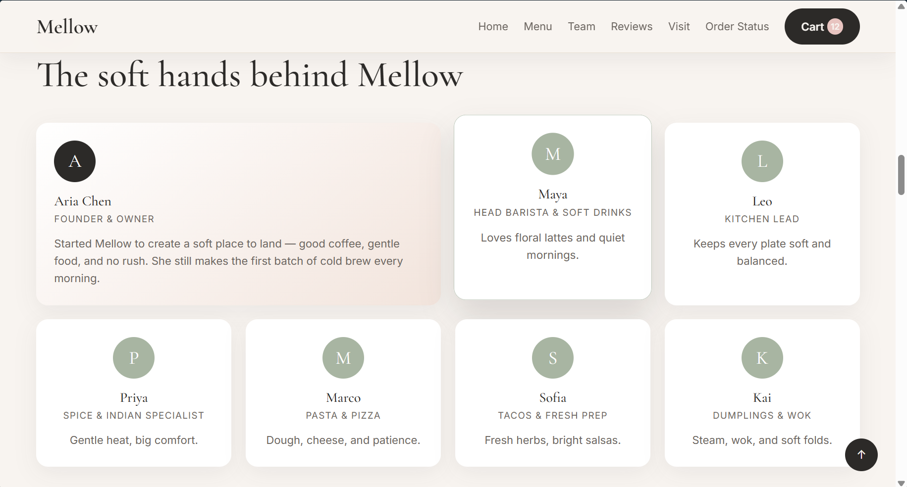 | 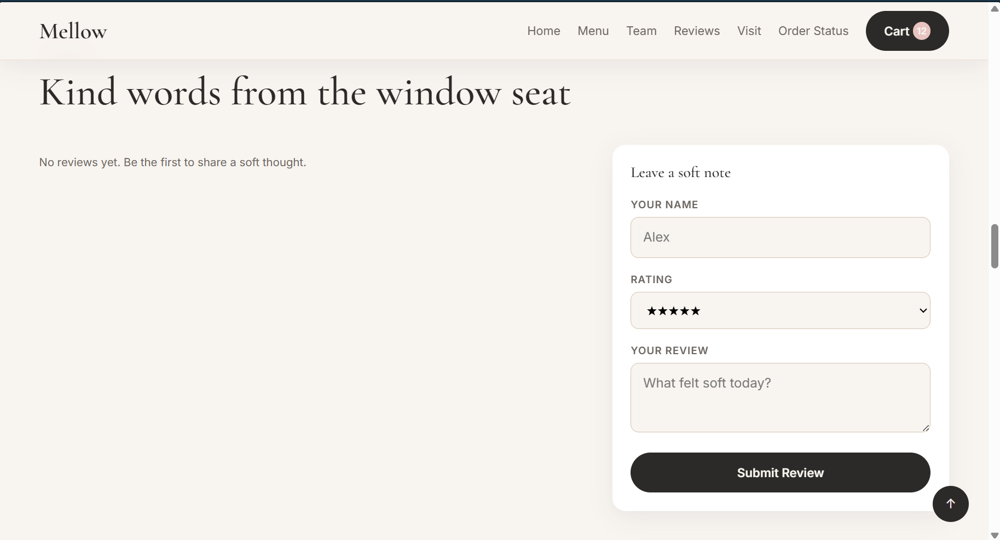 |

| Cart | Checkout |
|---|---|
| 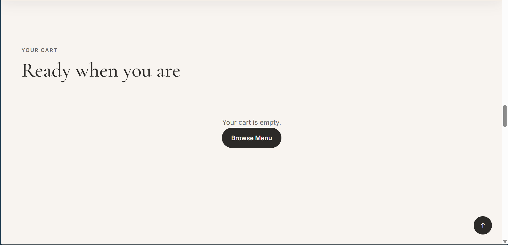 | 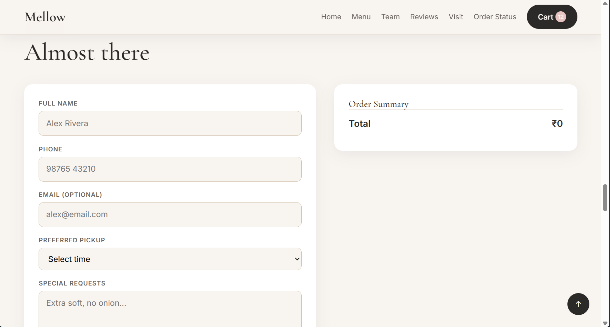 |

| Order Confirmation | Order Status |
|---|---|
| 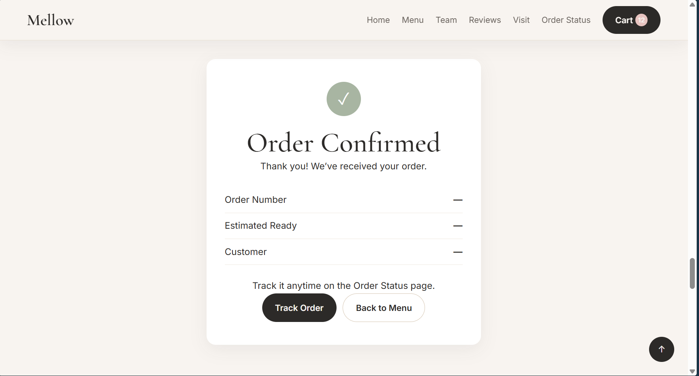 | 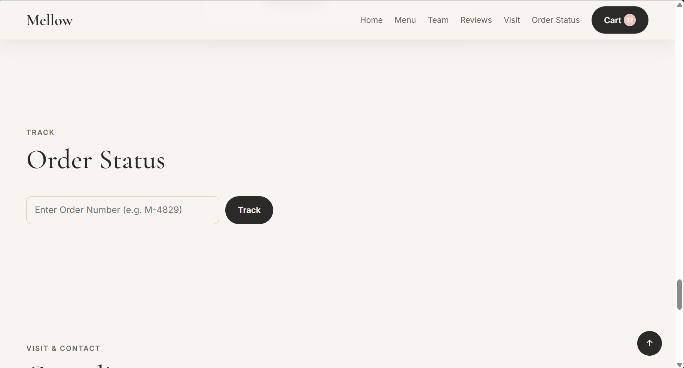 |

| Visit & Contact | About |
|---|---|
| 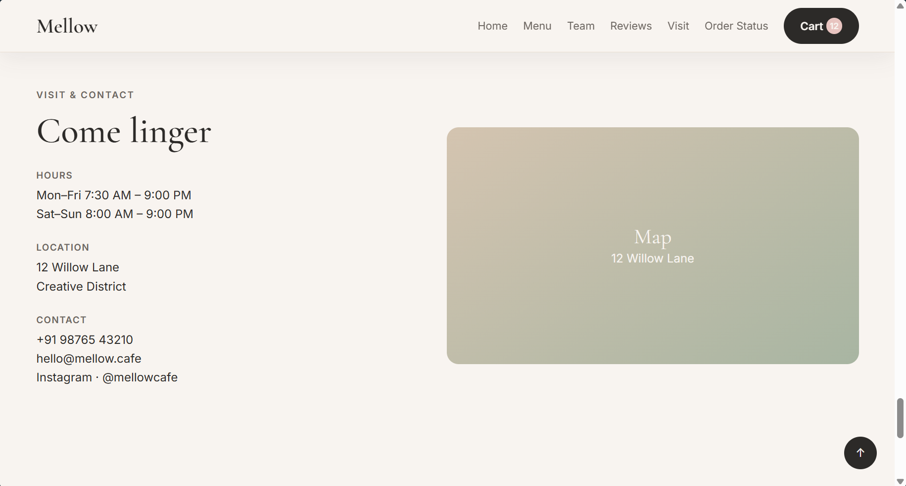 | 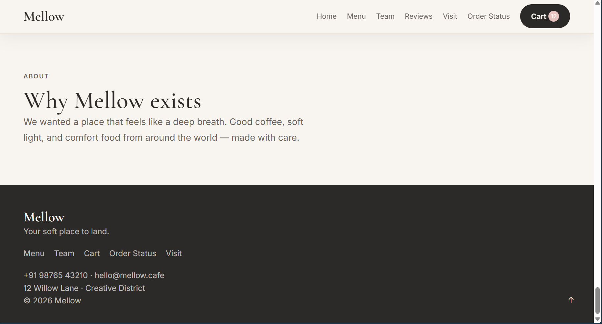 |

## 🛠️ Tech Stack

- **HTML5** — semantic, single-page structure with hash-based routing between sections
- **CSS3** — custom design system (see `styles.css`) using Google Fonts (Cormorant Garamond + Inter)
- **Vanilla JavaScript** — all app logic in `app.js`, no external libraries or frameworks
- **localStorage** — persists cart, orders, and reviews across sessions

## 📂 Project Structure

```
.
├── index.html      # Page markup and all sections (home, menu, cart, checkout, status, etc.)
├── styles.css       # All styling and responsive layout
├── app.js           # Menu data, cart logic, checkout, order tracking, reviews, nav
└── screenshots/      # Preview images used in this README
```

## 🚀 Getting Started

No build tools or dependencies required.

1. Clone the repository
   ```bash
   git clone https://github.com/<your-username>/mellow-cafe.git
   cd mellow-cafe
   ```
2. Open `index.html` directly in your browser, **or** serve it locally:
   ```bash
   python3 -m http.server 8000
   ```
   Then visit `http://localhost:8000`.

## 🧾 How Ordering Works

1. Browse the **Menu** and tap **Customize** on any item.
2. Choose size, add-ons, and quantity — the total updates live.
3. Add to cart, then head to **Cart** to review your order.
4. Proceed to **Checkout**, fill in your details and pickup time, and place the order.
5. You'll receive an order number (e.g. `M-4829`) — track it anytime on the **Order Status** page.

## 📄 License

This project is open source and available for personal or educational use. Feel free to fork and customize it for your own café or restaurant concept.

---

Made with ☕ and soft light.
